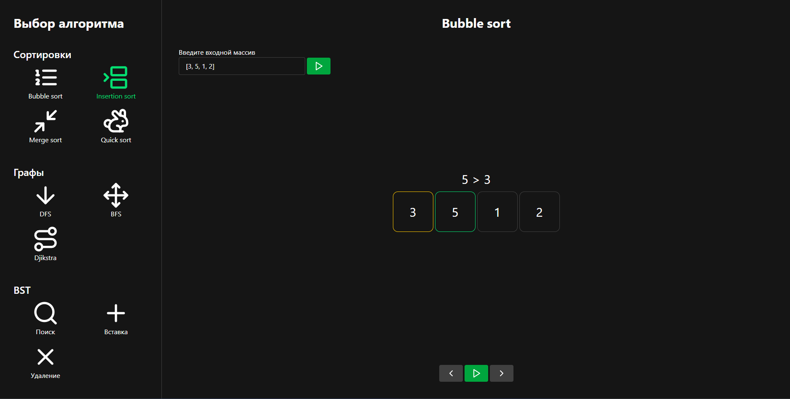

# 🧠 Sortify — Интерактивный визуализатор алгоритмов

**Sortify** — это веб-приложение для пошаговой визуализации алгоритмов, включая:
- 📊 **Сортировки** (Insertion, Bubble, Merge…)
- 🌳 **Двоичные деревья поиска**
- 🕸️ **Алгоритмы на графах** (DFS, BFS, Dijkstra…)
Создан для обучения, объяснений, анализа и отладки алгоритмов в понятной и наглядной форме.


## 📷 Демонстрация



Попробовать проект онлайн:  
[](https://sortify-sand.vercel.app/)

## 🚀 Возможности

- 🎞️ **Пошаговая визуализация** с анимацией
- ⏸️ **Пауза / Возобновление** алгоритма
- ⬅️➡️ **Шаг назад / вперёд**
- 📚 **Описание каждого шага**: наглядно объясняет, что происходит

## 🛠 Установка

```bash
git clone https://github.com/acidless/sortify.git
cd sortify
npm install
```

## ✅ Статус проекта

- Покрытие тестами: 
- Последние тесты: 


## 📝 Лицензия

Этот проект распространяется под лицензией MIT.
